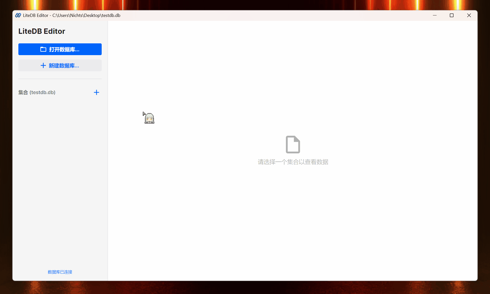
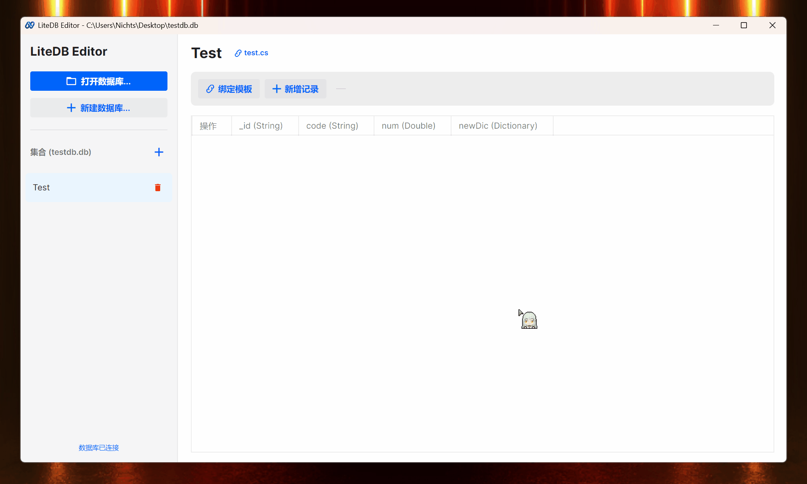
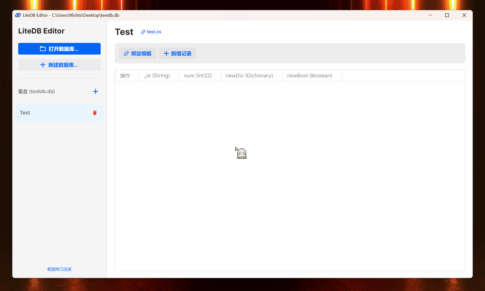
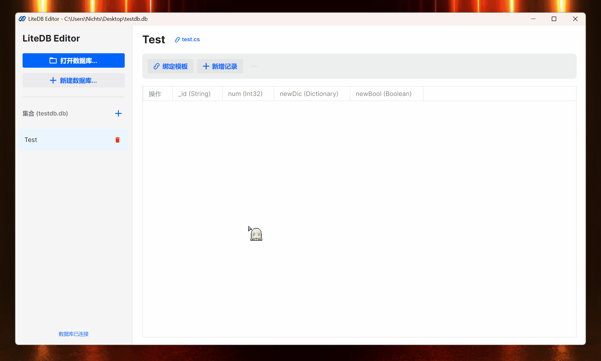

# LiteDB Editor 

[简体中文](README.md) | [English](README_en.md)

一个基于 **Avalonia 11** 和 **.NET 9** 构建的轻量级、响应式 LiteDB 数据库可视化管理工具。

---

## 核心特性 (Key Features)

- [x] **数据可视化管理**：直接在网格中增删改查数据，~~话说 LiteDB.Studio 为毛不搞个这功能？😤~~。
- [x] **智能模板绑定**：支持导入 C# 类定义作为数据填充模板，妈妈再也不用担心我 Json 写岔了😋。
- [x] **动态属性配置**：基于反射的动态 UI，支持复杂嵌套类型，但是太复杂可能不太行😅。
- [x] **单文件绿色运行**：无依赖、高性能的 Win-x64 可执行程序，但是文件**超级大**😨。

---

## 界面预览 (Screenshots)

> [!TIP]
> 来康康编辑器的功能😗

### 1. 集合相关

 **创建集合**（创建集合的同时会生成一个同名模板）  ps:你也可以从文件选择c#脚本
  

 **修改集合**（修改集合会更新同名模板）
  

~~下面功能特色🥵~~
### 2. 数据模板

 **内部辅助类**：创建内部类，存储复杂数据
  

 **使用模板**：使用现有模板创建新集合
  

### 3. 数据操作 😋

 **添加数据**
  

 **修改数据**
  

 ---

## 如何使用 (Quick Start)

1.  前往👉 [Releases](https://github.com/Nichts0v0/LiteDBEidtor/releases) 页面。
2.  根据你的系统，下载最新版的 `LiteDBEditor`，虽然很可能就只有一版。
3.  点击“打开数据库”选择或者创建 `.db` 文件。
4.  参考界面预览中的操作，为所欲为🤪。

---

## 技术栈 (Tech Stack)

- **UI Framework**: [Avalonia 11](https://avaloniaui.net/)
- **Runtime**: .NET 9 (Single File Publish)
- **Database**: [LiteDB 5.x](https://www.litedb.org/)
- **Theme**: [Semi.Avalonia](https://github.com/irihans/Semi.Avalonia)
- **Service**: 
  - `Roslyn` (C# Source Parsing)
  - `CommunityToolkit.Mvvm`

---

## 开源协议 (License)

本项目采用 [MIT License](LICENSE) 协议。

---

  Made with ❤️ by <b>Nichts Studio</b> & 一大堆AI🙈

ps:和AI打架💪也好累啊。 

